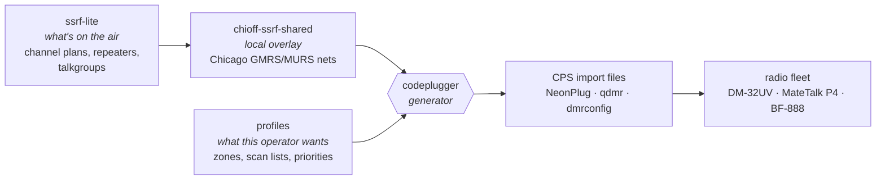

# Chicago Offline

Off-grid and independent comms for Chicagoland. We build and document the tooling
that makes radio hardware usable — mesh networking, DMR/GMRS codeplugs, and
reverse-engineered vendor formats — and we publish it so nobody else has to
rediscover it.

**Web:** <https://chicagooffline.com> · **Live packet analyzer:** <https://scope.chicagooffline.com>

## Projects

### Codeplugs & RF Data
- **codeplugger** — Codeplug generator. SSRF-Lite data + a profile → importable
  files for NeonPlug, qdmr, dmrconfig, and friends.
- **ssrf-lite** — YAML spec for describing spectrum resources, plus a data
  library of known channel plans, repeaters, DMR talkgroups, antenna systems.
- **chioff-ssrf-shared** — SSRF-Lite overlay for the Chicago Offline community
  nets (GMRS/MURS).

#### How the codeplug pipeline fits together

Spectrum data and operator intent stay in separate repos, so the same RF facts
feed every radio and a profile change never means re-describing the band plan.

### Radio Reverse Engineering
- **dm32-info** — Baofeng DM-32UV reference: specs, programming tools, firmware
  version tracking.
- **bf888-info** — Baofeng BF-888/888S image format, channel memory layout,
  CHIRP CSV notes.
- **retevis_matetalk_p4** — Retevis MateTalk P4 protocol reverse engineering.
- **p64tool** — fork of an opensource p64tool, adding support for the MateTalk P4

### Mesh
- **emuehlstein/meshcore** — A meshcore release preconfigured with mqtt reporting
  and chicagoland radio settings
- **emuehlstein/chioff-rns** - An rns server deployed to AWS via code

#### Chicagoland MeshCore Defaults

| Parameter | Value |
|---|---|
| Frequency | 910.525 MHz |
| Bandwidth | 62.5 kHz |
| Spreading factor | 7 |
| Coding rate | 5 |
| Path hash mode | 3-byte (`mode 2`) |

#### Chicagoland Reticulum Parameters

| Parameter | Value |
|---|---|
| Frequency | 914.875 MHz |
| Bandwidth | 125 KHz |
| Spreading factor | 8 |
| Coding rate | 5 |

## Getting Involved
Issues and PRs welcome on any repo. If you're in Chicagoland and want to put a
node on the mesh, start with the radio parameters above and open an issue or come
chat with us on the ChiMesh Discord.
